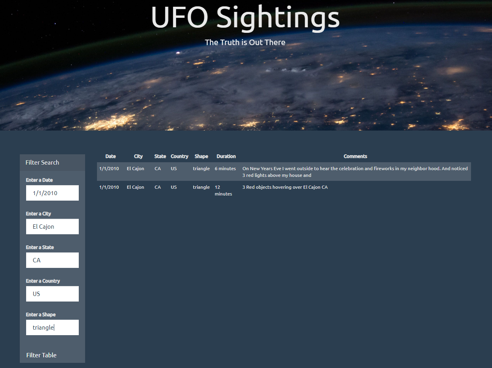

# UFO Sightings

Thanks for checking out my project's repo! By downloading this repo, you'll be able to search for information on UFO sightings.

<!-- TABLE OF CONTENTS -->
## Table of Contents

* [About the Project](#about-the-project)
  * [Built With](#built-with)
* [Project Instructions](#project-instructions)

<!-- About the Project -->
## About the Project
In the UFO-level-1 folder, you'll be able to search for UFO sightings based on dates from 1/1/2010 to 1/13/2010 in the filter search. Simply open the index.html file and get started! A screenshot of an example search is below: 
  
 

In the UFO-level-2 folder, you'll be able to search for UFO sightings based on date, city, state, country, and/or shape in the filter search. Simply open the index.html file and get started! A screenshot of an example search is below:  
  
 

<!--Built With-->
### Built With
This project was built using the following frameworks: 
* JavaScript
* Bootstrap
* HTML
* CSS

<!-- Project Instructions -->
## Project Instructions

### Background
WAKE UP SHEEPLE! The extra-terrestrial menace has come to Earth and we here at ALIENS-R-REAL have collected all of the eye-witness reports we could to prove it! All we need to do now is put this information online for the world to see and then the matter will finally be put to rest. 
 
There is just one tiny problem though... our collection is too large to search through manually. Even our most dedicated followers are complaining that they are having trouble locating specific reports in this mess. 
 
That's why we are hiring you. We need you to write code that will create a table dynamically based upon a dataset we provide. We also need to allow our users to filter the table data for specific values. There's a catch though... we only use pure JavaScript, HTML, and CSS, and D3.js on our web pages. They are the only coding languages which can be trusted. 
 
You can handle this... right? The planet Earth needs to know what we have found! 

### Level 1: Automatic Table and Date Search (Required)
- Using the UFO dataset provided in the form of an array of JavaScript objects, write code that appends a table to your web page and then adds new rows of data for each UFO sighting. 
  - Make sure you have a column for date/time, city, state, country, shape, and comments. 
- Use a date form in your HTML document and write JavaScript code that will listen for events and search through the date/time column to find rows that match user input. 

### Level 2: Multiple Search Categories (Optional)
- Complete all of Level 1 criteria. 
- Using multiple input tags, write JavaScript code so the user can set multiple filters and search for UFO sightings using the following criteria based on the table columns: 
  - date/time 
  - city 
  - state 
  - country 
  - shape