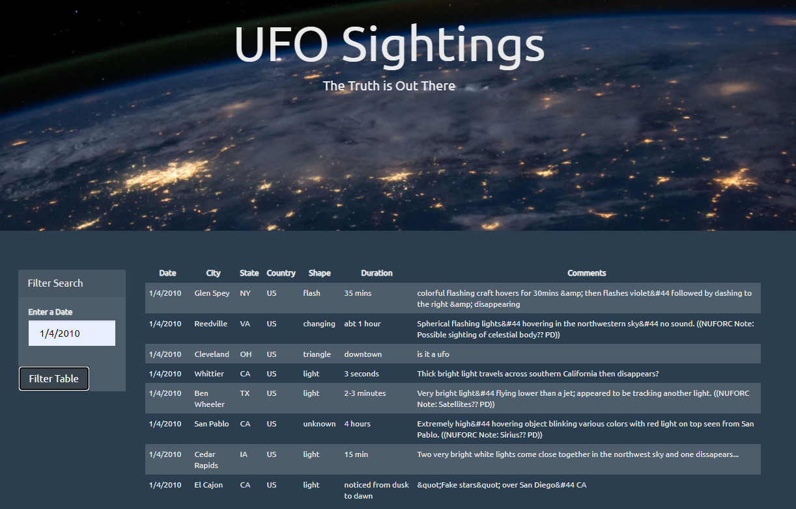

## javascript-challenge

Thanks for checking out my project's repo! By downloading this repo, you'll be able to search for information on UFO sightings. 
In the UFO-level-1 folder, you'll be able to search for UFO sightings based on dates from 1/1/2010 to 1/13/2010 in the filter search. Simply open the index.html file and get started! A screenshot of an example search is below: 
  

In the UFO-level-2 folder, you'll be able to search for UFO sightings based on date, city, state, country, or shape in the filter search. Simply open the index.html file and get started!A screenshot of an example search is below:  
 

### Instructions for Challenge

#### Level 1: Automatic Table and Date Search
- Using the UFO dataset provided in the form of an array of JavaScript objects, write code that appends a table to your web page and then adds new rows of data for each UFO sighting. 
  - Make sure you have a column for date/time, city, state, country, shape, and comments. 
- Use a date form in your HTML document and write JavaScript code that will listen for events and search through the date/time column to find rows that match user input. 

#### Level 2: Multiple Search Categories (Optional)
- Complete all of Level 1 criteria. 
- Using multiple input tags and/or select dropdowns, write JavaScript code so the user can to set multiple filters and search for UFO sightings using the following criteria based on the table columns: 
  - date/time 
  - city 
  - state 
  - country 
  - shape